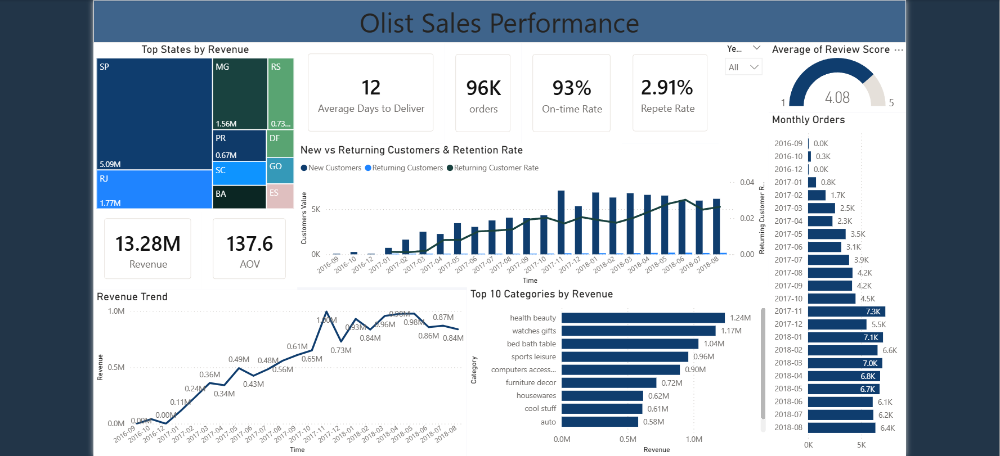

# Olist Sales Performance Dashboard (Power BI + MySQL)

A portfolio project that builds an end-to-end BI pipeline using the Olist Brazilian e-commerce dataset:
**CSV → MySQL (ETL) → Star Schema Views → Power BI Dashboard**.

## Dashboard Highlights
- **Revenue / Orders / AOV**
- **On-time Rate** and **Average Days to Deliver**
- **Customer Retention**: New vs Returning Customers + Returning Customer Rate (monthly)
- **Top States by Revenue** and **Top Categories by Revenue**
- **Average Review Score**

## Tech Stack
- **MySQL 8.0**
- **Python** (pandas, SQLAlchemy, PyMySQL)
- **Power BI Desktop**

## Data Model (Star Schema)
- `fact_sales` (grain: order_item)
- `dim_customer`, `dim_product`, `dim_seller`, `dim_geo`, `dim_date`

## Repository Structure
- `sql/` - DDL + views to build fact/dim tables
- `python/` - ETL script to load 9 CSVs into MySQL
- `powerbi/` - Power BI dashboard (.pbix) + dashboard PDF export
- `assets/` - screenshots used in README

## How to Reproduce
### 1) Prepare Data
Download the Olist dataset CSV files locally (not included in this repo).
Place them into a local folder, e.g. `data/`.

### 2) Create MySQL Database & Tables
Run:
- `sql/01_create_tables.sql`

### 3) Load CSVs into MySQL (Python ETL)
Set environment variables (example):
- `MYSQL_HOST=127.0.0.1`
- `MYSQL_PORT=3307`
- `MYSQL_USER=bi_user`
- `MYSQL_PASSWORD=***`
- `MYSQL_DB=olist_bi`
- `DATA_DIR=path_to_your_data_folder`

Run:
- `python/load_olist_csv_to_mysql.py`

### 4) Build Views (Fact/Dim)
Run:
- `sql/02_build_views.sql`

### 5) Open Power BI
Open:
- `powerbi/olist_sales_dashboard.pbix`
Then click **Refresh** (update connection settings if needed).

## Notes
- The `.pbix` file uses a local MySQL connection. If you change host/port/user, update it in **Transform Data → Data source settings**.
- The dataset files are not uploaded to GitHub to keep the repository lightweight.

## Credit
Dataset: Olist Brazilian E-Commerce Public Dataset.
